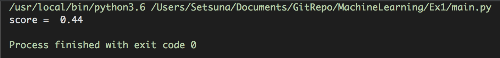

 <center><font size=72>机器学习实验报告</font></center>


|    实验号    |      第1次      |
| :----------: | :-------------: |
|   **姓名**   |   **鲍超俊**    |
|   **学号**   | **15020510059** |
| **指导老师** |   **杨淑媛**    |

<div style="page-break-after:always;"></div>

### 一、实验内容

------

&emsp;&emsp;You are offered an excel file. In this file, you can get the information of all the students in XXX university. The information includes students’ personal information (such as name, student ID, respective departments, age, native place) and course information (such as name of the courses and their respective grades). You are asked to build a classification model to divide the grades into five categories: excellent, good, medium, pass, fail. The classification process is based on the information of name and native place. You should also show you results in a visual way. 


### 二、实验结果

---




### 三、程序清单

---

```python
import numpy as np
from sklearn.discriminant_analysis import LinearDiscriminantAnalysis
from sklearn.svm import SVC


class import_data(object):
    """
    导入数据、编码、归一化
    """

    def __init__(self):
        self.names = np.loadtxt("data.csv", dtype=np.str, usecols=(1,), delimiter=',')
        self.place = np.loadtxt("data.csv", dtype=np.float32, usecols=(4,), delimiter=',')
        self.__init_X__()
        self.__init_y__()
        return

    def __encode__(self, names, n_max=8):
        """
        给姓名编码
        :param names: 姓名列表
        :param n_max: 姓名最长长度
        :return: 编码后的矩阵
        """
        if len(names) == 0:
            return
        names_mat = []
        for name in names:
            name_vec = []
            for i in range(n_max):
                try:
                    x = (ord(name[i]) - 96) / 26
                except:
                    x = 0
                name_vec.append(x)
            names_mat.append(name_vec)
        names_mat = np.array(names_mat, dtype=np.float32)
        return names_mat

    def __init_X__(self):
        """
        初始化样本
        :return: 样本
        """
        name = self.__encode__(self.names)
        place = (self.place.reshape((-1, 1)) - 101) / 108
        self.X = np.concatenate((name, place), axis=1)
        return

    def __init_y__(self):
        """
        初始化类别标签
        :return: 列别标签
        """
        scores = np.loadtxt("data.csv", dtype=np.float32, usecols=(8,), delimiter=',')
        y = []
        for score in scores:
            if score > 90:
                # y.append('b')
                y.append(0)
            else:
                if score > 80:
                    # y.append('c')
                    y.append(1)
                else:
                    if score > 70:
                        # y.append('g')
                        y.append(2)
                    else:
                        if score > 60:
                            # y.append('k')
                            y.append(3)
                        else:
                            # y.append('m')
                            y.append(4)
        self.y = np.array(y)
        return


if __name__ == '__main__':
    data = import_data()
    X = data.X
    y = data.y
    lda = LinearDiscriminantAnalysis(n_components=2)
    lda.fit(X, y)
    X = lda.transform(X)
    # plt.scatter(X[:, 0], X[:, 1], c=y, marker='.')
    svm = SVC()
    model = svm.fit(X, y)
    score = svm.score(X, y)
    print("score = ", score)

```

