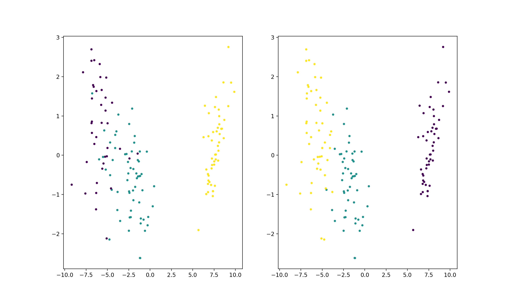
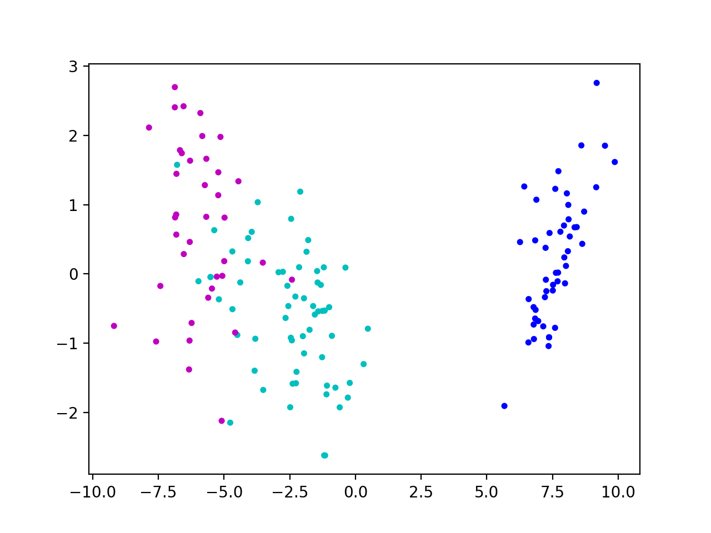

 <center><font size=72>机器学习实验报告</font></center>


|          |             |
| :------: | :---------: |
|   姓名   |   鲍超俊    |
|   学号   | 15020510059 |
| 指导老师 |   杨淑媛    |


[TOC]


### 一、实验内容

---

You are offered the iris dataset of the UCI dataset. Cluster the data to three categories. Then compare the result with the correct one in iris dataset and compute the classification accuracy.


### 二、实验原理（聚类算法）

---

#### 1. K-均值聚类算法

##### 1.1 算法简介

​	k-均值聚类算法（k-means clustering）源于信号处理中的一种向量量化方法，现在则更多地作为一种聚类分析方法流行于数据挖掘领域。k-均值聚类的目的是：把n个点（可以是样本的一次观察或一个实例）划分到k个聚类中，使得每个点都属于离他最近的均值（此即聚类中心）对应的聚类，以之作为聚类的标准。这个问题将归结为一个把数据空间划分为Voronoi cells的问题。
这个问题在计算上是困难的（NP困难），不过存在高效的启发式算法。一般情况下，都使用效率比较高的启发式算法，它们能够快速收敛于一个局部最优解。这些算法通常类似于通过迭代优化方法处理高斯混合分布的最大期望算法（EM算法）。而且，它们都使用聚类中心来为数据建模；然而k-均值聚类倾向于在可比较的空间范围内寻找聚类，期望-最大化技术却允许聚类有不同的形状。

##### 1.2 算法描述

​	已知观测集$(x_1,x_2,…,x_n)$，其中每个观测都是一个$d$维实向量，k-平均聚类要把这$n$个观测划分到$k$个集合中$(k \leq n)$,使得组内平方和最小。换句话说，它的目标是找到使得下式满足的聚类$S_i$，
$$
\underbrace{min}_{S}\sum_{i=1}^{k}{\sum_{\mit x \in S_i}{\vert\vert \mit x-\mu_i \vert\vert}^2}
$$
其中$\mu_i$是$S_i$中所有点的均值。


#### 2. K-中心点聚类算法

##### 2.1 算法简介

​	K-中心点算法也是一种常用的聚类算法，K-中心点聚类的基本思想和K-均值的思想相同，实质上是对K-均值算法的优化和改进。在K-均值聚类算法中，异常数据对其的算法过程会有较大的影响。在K-均值算法执行过程中，可以通过随机的方式选择初始质心，也只有初始时通过随机方式产生的质心才是实际需要聚簇集合的中心点，而后面通过不断迭代产生的新的质心很可能并不是在聚簇中的点。如果某些异常点距离质心相对较大时，很可能导致重新计算得到的质心偏离了聚簇的真实中心。 

##### 2.2 算法流程

```flow
st=>start: 开 始
op1=>operation: 确定聚类数目K
op2=>operation: 初始化聚类中心
op3=>operation: 依据距离聚类
op4=>operation: 更新聚类中心
cond=>condition: 聚类中心是否收敛
io=>inputoutput: 输出聚类结果
e=>end: 结 束
st->op1->op2->op3->op4->cond
cond(yes)->io->e
cond(no)->op3
```


### 三、实验结果

---

#### 1. K-means



#### 2. K-mediods


#### 3. K-means (scikit-learn)




### 四、程序说明

#### 1. 工具包清单

 + numpy
+ sklearn.discriminant_analysis.LinearDiscriminantAnalysis
+ matplotlib.pyplot

#### 2. 模块功能

> Kmeans.py

```python 
def initialize(X,y):
    """
    初始化数据
    :param X: 样本
    :param y: 标签
    :return: [样本, 标签, 初始聚类中心]
    """
    pass
```

```python
def cluster(data, means):
    """
    依据距离聚类
    :param data: 样本
    :param means: 均值
    :return: 聚类结果
    """
	pass
```

```python
def mean(data, label):
    """
    计算均值
    :param data: 样本 
    :param label: 聚类结果
    :return: 均值
    """
    pass
```

```python
def convergent(pre_cent, cur_cent, epsilon):
    """
    判断是否收敛
    :param pre_cent: 前一次聚类中心
    :param cur_cent: 当前聚类中心
    :param epsilon: 阈值
    :return: 是否收敛
    """
    pass
```

```python
def kmeans(X,y):
    """
    kmeans入口
    :param X: 样本
    :param y: 标签
    :return: 
    """
    pass
```

> Kmediods.py

​	同Kmeans.py

