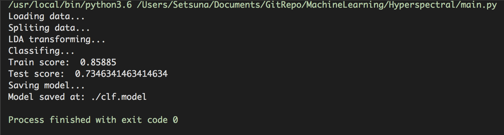

 <center><font size=72>机器学习大作业</font></center>


|    实验号    | 高光谱数据分类  |
| :----------: | :-------------: |
|   **姓名**   |   **鲍超俊**    |
|   **学号**   | **15020510059** |
| **指导老师** |   **杨淑媛**    |

<div style="page-break-after:always;"></div>

### 一、支撑矢量机

------

#### 1. 算法简介

&emsp;&emsp;在机器学习中，支持向量机（英语：support vector machine，常简称为SVM，又名支持向量网络）是在分类与回归分析中分析数据的监督式学习模型与相关的学习算法。给定一组训练实例，每个训练实例被标记为属于两个类别中的一个或另一个，SVM训练算法创建一个将新的实例分配给两个类别之一的模型，使其成为非概率二元线性分类器。SVM模型是将实例表示为空间中的点，这样映射就使得单独类别的实例被尽可能宽的明显的间隔分开。然后，将新的实例映射到同一空间，并基于它们落在间隔的哪一侧来预测所属类别。

&emsp;&emsp;除了进行线性分类之外，SVM还可以使用所谓的核技巧有效地进行非线性分类，将其输入隐式映射到高维特征空间中。


#### 2. 相关概念

> 函数间隔

&emsp;&emsp;在分离超平面固定为$w^Tx+b=0$的时候，$|w^Tx+b|$表示点$x$到超平面的距离。通过观察$w^Tx+b$和$y$是否同号，我们判断分类是否正确。这里我们引入函数间隔的概念，定义函数间隔$\gamma'$为：
$$
\gamma' = y(w^Tx+b)
$$

> 几何间隔

&emsp;&emsp;函数间隔并不能正常反应点到超平面的距离，当分子成比例的增长时，分母也是成倍增长。为了统一度量，我们需要对法向量$w$加上约束条件，这样我们就得到了几何间隔$\gamma$,定义为：
$$
\gamma = \frac{y(w^Tx + b)}{||w||_2} =  \frac{\gamma^{'}}{||w||_2}
$$

> 支持向量

&emsp;&emsp;在感知机模型中，我们可以找到多个可以分类的超平面将数据分开，并且优化时希望所有的点都离超平面远。但是实际上离超平面很远的点已经被正确分类，我们让它离超平面更远并没有意义。反而我们最关心是那些离超平面很近的点，这些点很容易被误分类。如果我们可以让离超平面比较近的点尽可能的远离超平面，那么我们的分类效果会好有一些。SVM的思想起源正起于此。

&emsp;&emsp;如下图所示，分离超平面为$w^Tx+b=0$，如果所有的样本不光可以被超平面分开，还和超平面保持一定的函数距离，那么这样的分类超平面是比感知机的分类超平面优的。可以证明，这样的超平面只有一个。和超平面平行的保持一定的函数距离的这两个超平面对应的向量，我们定义为支持向量，如下图虚线所示。


#### 3. SVM模型目标函数

&emsp;&emsp;SVM的模型是让所有点到超平面的距离大于一定的距离，也就是所有的分类点要在各自类别的支持向量两边。用数学式子表示为：
$$
max \;\; \gamma = \frac{y(w^Tx + b)}{||w||_2}  \;\; s.t \;\; y_i(w^Tx_i + b) = \gamma^{'(i)} \geq \gamma^{'} (i =1,2,...m)
$$
&emsp;&emsp;一般取函数间隔$γ′$为1，这样优化函数定义为：
$$
max \;\; \frac{1}{||w||_2}  \;\; s.t \;\; y_i(w^Tx_i + b)  \geq 1 (i =1,2,...m)
$$
&emsp;&emsp;也就是说，我们要在约束条件$y_i(w^Tx_i + b)  \geq 1 (i =1,2,…m)$下，最大化$\frac{1}{||w||_2}$。可以看出，这个感知机的优化方式不同，感知机是固定分母优化分子，而SVM是固定分子优化分母，同时加上了支持向量的限制。

&emsp;&emsp;由于$\frac{1}{||w||_2}$的最大化等同于$\frac{1}{2}||w||_2^2$的最小化。这样SVM的优化函数等价于：
$$
min \;\; \frac{1}{2}||w||_2^2  \;\; s.t \;\; y_i(w^Tx_i + b)  \geq 1 (i =1,2,...m)
$$
&emsp;&emsp;由于目标函数$\frac{1}{2}||w||_2^2$是凸函数，同时约束条件不等式是仿射的，根据凸优化理论，可以通过拉格朗日函数将我们的优化目标转化为无约束的优化函数:
$$
L(w,b,\alpha) = \frac{1}{2}||w||_2^2 - \sum\limits_{i=1}^{m}\alpha_i[y_i(w^Tx_i + b) - 1] 
$$
&emsp;&emsp;由于引入了朗格朗日乘子，我们的目标函数变成：
$$
\underbrace{min}_{w,b}\; \underbrace{max}_{\alpha_i \geq 0} L(w,b,\alpha)
$$

#### 4. 线性可分SVM算法过程

> 输入:线性可分的m个样本$(x_1,y_1),(x_2,y_2),...,(x_m,y_m)$,其中$x$为$n$维特征向量。$y$为二元输出。
>
> 输出：分离超平面的参数$(w^*,b^*)$和分类决策函数。

算法过程如下：

1）构造约束优化问题
$$
\underbrace{min}_{\alpha} \frac{1}{2}\sum\limits_{i=1}^{m}\sum\limits_{j=1}^{m}\alpha_i\alpha_jy_iy_j(x_i ^T x_j) -  \sum\limits_{i=1}^{m} \alpha_i
$$

$$
s.t. \; \sum\limits_{i=1}^{m}\alpha_iy_i = 0
$$

$$
\alpha_i \geq 0  \; i=1,2,...m
$$

2）用SMO算法求出上式最小时对应的$\alpha$向量的值$\alpha^*$向量.

3) 计算
$$
w^{*} = \sum\limits_{i=1}^{m}\alpha_i^{*}y_ix_i
$$
4) 找出所有的S个支持向量,即满足$a_s>0$对应的样本$(x_s,y_s)$，通过$y_s(\sum\limits_{i=1}^{m}\alpha_iy_ix_i^Tx_s+b) = 1$，计算出每个支持向量$(x_s,y_s)$对应的$b_s^*$,计算出这些$b_s^{*} = y_s - \sum\limits_{i=1}^{m}\alpha_iy_ix_i^Tx_s$. 所有的$b_s^*$对应的平均值即为最终的$b^{*} = \frac{1}{S}\sum\limits_{i=1}^{S}b_s^{*}$.

最终的分类超平面为：
$$
w^{*T} x + b^{*} = 0
$$
最终的分类决策函数为：
$$
f(x) = sign(w^{*T}  x + b^{*})
$$

#### 5. 核函数的引入

&emsp;&emsp;线性不可分的低维特征数据，可以将其映射到高维使其线性可分。由线性可分SVM的优化目标函数中低维特征仅仅以内积$x_i^Tx_j$的形式出现，如果定义一个低维特征空间到高维特征空间的映射$\phi$, 将所有特征映射到一个更高的维度，让数据线性可分，就可以用凸优化方法来优化目标函数，求解分离超平面和分类决策函数。映射后的SVM目标函数变为:
$$
\underbrace{ min }_{\alpha}  \frac{1}{2}\sum\limits_{i=1,j=1}^{m}\alpha_i\alpha_jy_iy_j\phi(x_i) \bullet \phi(x_j) - \sum\limits_{i=1}^{m}\alpha_i
$$

$$
s.t. \; \sum\limits_{i=1}^{m}\alpha_iy_i = 0
$$

$$
0 \leq \alpha_i \leq C
$$

> 核函数定义

&emsp;&emsp;假设$\phi$是一个从低维的输入空间$\chi$（欧式空间的子集或者离散集合）到高维的希尔伯特空间的$\mathcal{H}$映射。那么如果存在函数$K(x,z)$，对于任意$x,z∈χ$，都有:
$$
K(x, z) = \phi(x_i) \bullet \phi(x_j)
$$
那么我们就称$K(x,z)$为核函数。


> 常见核函数

1）线性核函数（Linear Kernel）
$$
K(x, z) = x \bullet z
$$
2）多项式核函数（Polynomial Kernel）
$$
K(x, z) = （\gamma x \bullet z  + r)^d
$$
3）高斯核函数（Gaussian Kernel）
$$
K(x, z) = e^{-\gamma||x-z||^2}
$$
4）sigmoid核函数（Sigmoid Kernel）
$$
K(x, z) = tanh（\gamma x \bullet z  + r)
$$

#### 6. 通用SVM算法过程

> 输入:线性可分的m个样本$(x_1,y_1),(x_2,y_2),...,(x_m,y_m)$,其中$x$为$n$维特征向量。$y$为二元输出。
>
> 输出：分离超平面的参数$(w^*,b^*)$和分类决策函数。

算法过程:

1）选择适当的核函数$K(x,z)$和一个惩罚系数$C>0$, 构造约束优化问题:
$$
\underbrace{ min }_{\alpha}  \frac{1}{2}\sum\limits_{i=1,j=1}^{m}\alpha_i\alpha_jy_iy_jK(x_i,x_j) - \sum\limits_{i=1}^{m}\alpha_i
$$

$$
s.t. \; \sum\limits_{i=1}^{m}\alpha_iy_i = 0
$$

$$
0 \leq \alpha_i \leq C
$$

2）用SMO算法求出上式最小时对应的$\alpha$向量的值$\alpha^*$向量.

3) 得到$w^{*} = \sum\limits_{i=1}^{m}\alpha_i^{*}y_i\phi(x_i)$

4) 找出所有的S个支持向量,即满足$0<α_s<C$对应的样本$(x_s,y_s)$，通过$ y_s(\sum\limits_{i}^mα_iy_iK(x_i,x_s)+b)=1$，计算出每个支持向量$(x_s,y_s)$对应的$b_s^*$,计算出这些$b_s^*=y_s−\sum\limits_{i=1}^{m}α_iy_iK(x_i,x_s)$. 所有的$b_s^{*}$对应的平均值即为最终的$b^{*} = \frac{1}{S}\sum\limits_{i=1}^{S}b_s^{*}$

最终的分类超平面为：
$$
\sum\limits_{i=1}^{m}\alpha_i^{*}y_iK(x, x_i)+ b^{*} = 0
$$
最终的分类决策函数为：
$$
f(x) = sign(\sum\limits_{i=1}^{m}\alpha_i^{*}y_iK(x, x_i)+ b^{*})
$$


#### 2. 程序说明

> Preprocessor.py

读取图像并reshape成向量同时生成标签。

> Gamma_score.py

利用网格搜索找到不同核函数在区间$[0,01]$间的近似最优gamma值并画出gamma与分类器性能的关系图像。在网格搜索过程中，对每一组参数使用10-fold交叉验证。

> GridSearchCV.py

利用网格搜索找到最优参数（核函数，gamma，惩罚因子C）。在网格搜索过程中，对每一组参数使用10-fold交叉验证。

<div style="page-break-after:always;"></div>

### 二、实验结果

---

> 控制台输出




### 三、程序说明

---

#### 1. 工具包清单

 + numpy
+ sklearn.svm
+ sklearn.externals.joblib
+ sklearn.discriminant_analysis.LinearDiscriminantAnalysis


#### 2. 模块功能

```python
if __name__ == '__main__':
    # 导入数据
    aviris = import_data()
    X = aviris.X
    y = aviris.y

    # 划分训练集和测试集
    print("Spliting data...")
    X_train = X[:20000, :]
    y_train = y[:20000]
    X_test = X[20000:, :]
    y_test = y[20000:]

    # 利用 LDA 降维
    print("LDA transforming...")
    lda = LinearDiscriminantAnalysis(n_components=50)
    lda.fit(X_train, y_train)
    X_train = lda.transform(X_train)
    X_test = lda.transform(X_test)

    # 使用 SVM 分类
    print("Classifing...")
    svc = svm.SVC(kernel='rbf')
    svc.fit(X_train, y_train)
    train_score = svc.score(X_train, y_train)
    test_score = svc.score(X_test, y_test)
    print("Train score: ", train_score)
    print("Test score: ", test_score)

    # 保存模型
    print("Saving model...")
    joblib.dump(svc, "./clf.model")
    print("Model saved at: ./clf.model")
```


